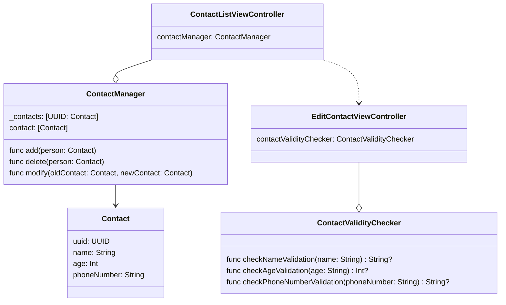

# ios-contact-manager-ui

# UML

```mermaid
classDiagram

class Contact {
  uuid: UUID
  name: String
  age: Int
  phoneNumber: String
}

class ContactManager {
  _contacts: [UUID: Contact]
  contact: [Contact]

  func add(person: Contact)
  func delete(person: Contact)
  func modify(oldContact: Contact, newContact: Contact)
}

class ContactValidityChecker {
  func checkNameValidation(name: String) String?
  func checkAgeValidation(age: String) Int?
  func checkPhoneNumberValidation(phoneNumber: String) String?
}

class ContactListViewController {
  contactManager: ContactManager
}

class EditContactViewController {
  contactValidityChecker: ContactValidityChecker
}

ContactManager --> Contact
ContactListViewController --o ContactManager
EditContactViewController --o ContactValidityChecker
ContactListViewController ..> EditContactViewController
```
